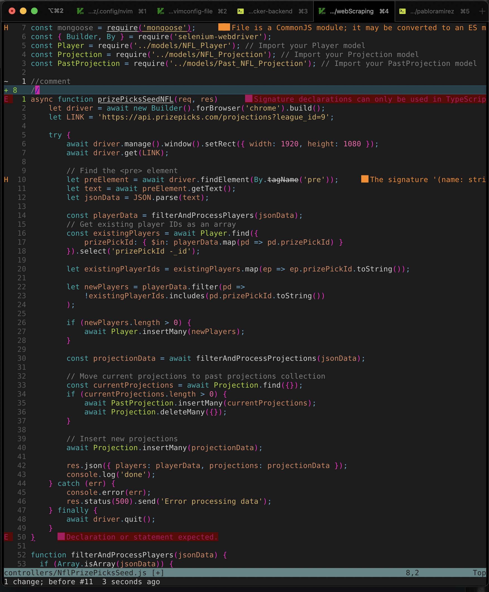

# graslowsnail's nvim setup
## "What IDE is that?"
## "Oh this? just VIM"

## Revamped Nvim Config with Lua!  
A simple and clean Neovim setup to improve your terminal-based workflow on macOS, with features like auto-completion, Git integration, enhanced syntax highlighting, and AI-powered code suggestions. Perfect for developers looking to optimize their productivity in the terminal.

## Favorit plugins!
* Nerd Tree - File navigation in vim
* Devivons - Adds file icons on nerd tree!
* tree sitter - adds more syntax color!
* papercolor - Current theme!

## Screenshots

